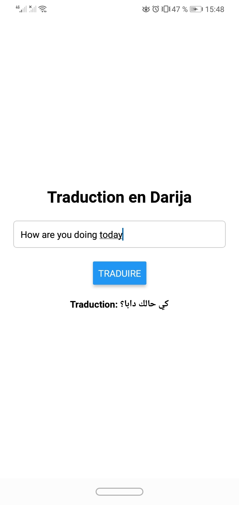

#   Darija Translator API

> Service RESTful Jakarta EE propulsé par **Google Gemini 1.5 Flash** pour traduire des textes latins vers le darija marocain (الدارجة).

---

##  Stack technique

| Technologie | Version | Rôle |
|---|---|---|
| Jakarta EE | 10 | Framework backend |
| Java SE | 17 | Runtime |
| JAX-RS | — | API RESTful |
| Google Gemini | 1.5 Flash | Moteur de traduction IA |
| Maven Wrapper | — | Build tool |

> Compatible avec tout serveur Jakarta EE : **WildFly**, **GlassFish**, **Payara**, etc.

---

##  Installation & Build

**Prérequis :** Java 17 installé
```bash
# 1. Cloner le dépôt
git clone https://github.com/votre-user/votre-repo.git
cd votre-repo

# 2. Build
./mvnw clean package          # Linux / macOS
mvnw.cmd clean package        # Windows
```

Le build génère : `target/jakartaee-hello-world.war`
```bash
# 3. Déployer sur WildFly (exemple)
cp target/jakartaee-hello-world.war $WILDFLY_HOME/standalone/deployments/
```

---

##  Utilisation

Base URL : `http://localhost:8080/jakartaee-hello-world`

### `POST /api/translate`

Traduit un texte latin vers le darija marocain.

**Request**
```http
POST /api/translate
Content-Type: application/json
```
```json
{
  "text": "Salve! Quid agis?"
}
```

**Response**
```json
{
  "response": "سلام! كيداير؟"
}
```

**Exemple curl**
```bash
curl -X POST http://localhost:8080/jakartaee-hello-world/api/translate \
  -H "Content-Type: application/json" \
  -d '{"text": "Salve! Quid agis?"}'
```

**Exemple Postman**
```
Method  : POST
URL     : http://localhost:8080/jakartaee-hello-world/api/translate
Headers : Content-Type: application/json
Body    : raw → JSON → { "text": "Bonjour, comment vas-tu?" }
```

---

##  Structure du projet
```
jakartaee-hello-world/
├── src/
│   └── main/
│       ├── java/
│       │   └── ...RestApplication.java   ← point d'entrée JAX-RS
│       │   └── ...TranslateResource.java ← endpoint /api/translate
│       └── webapp/
│           └── WEB-INF/
│               └── web.xml
├── pom.xml
├── mvnw / mvnw.cmd
└── README.md
```
## App mobile 



##  Notes

- Les langues sources supportées sont les langues à écriture latine (français, anglais, espagnol, latin, etc.)
- La réponse est toujours en **darija marocain** écrit en **caractères arabes**
- Généré à partir du **Eclipse Foundation Jakarta EE Starter**
